## Masterclass on nonnegative LRA

:::: {.columns}
::: {.column width="55%"}

### Lecture 1

**Nonnegative matrix and tensor low-rank approximations**

- theory of regularized low-rank models
- source separation viewpoint
- NMF, nonnegative CP, and nonnegative Tucker

 

Jérémy Cohen  
CREATIS, CNRS

:::
::: {.column width="45%"}

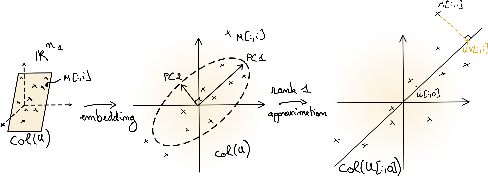{width="100%"}

:::
::::

## Regularized low-rank approximation

Low-rank models appear in many inverse problems and source-separation tasks.

$$
\min_{W,H} f(M,WH^\top) + g_W(W) + g_H(H)
$$

Typical choices:

- $f(M,WH^\top)=\|M-WH^\top\|_F^2$
- $g_W,g_H$ enforce nonnegativity, sparsity, or structure

## Matrix low-rank models

Two equivalent viewpoints:

$$
M = UV^\top = \sum_{q=1}^r U[:,q]V[:,q]^\top
$$

- subspace view: $U$ spans a low-dimensional subspace
- atomic view: $M$ is a sum of $r$ rank-one matrices

## From observations to latent components

:::: {.columns}
::: {.column width="62%"}

- We observe mixtures, not isolated sources
- We seek a small number of latent patterns
- We explain each observation as combinations of these patterns

This is the common structure behind hyperspectral imaging, chemometrics, music, and biomedical data.

:::
::: {.column width="38%"}

{width="100%"}

:::
::::

## Spectra as a compressed observation model

:::: {.columns}
::: {.column width="56%"}

- a spectrum $s(\lambda)$ lives in a high-dimensional function space
- RGB is a 3-dimensional compression of $s$
- the compression is linear but lossy

:::
::: {.column width="44%"}

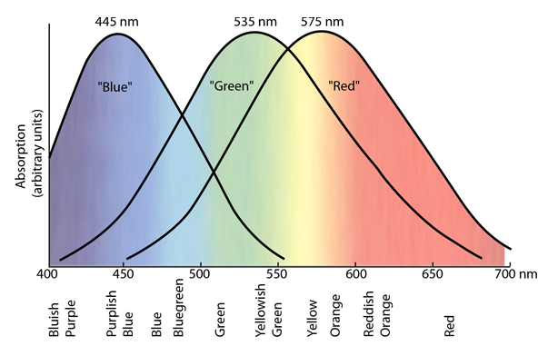{width="100%"}

:::
::::

$$
c_j = \int_{\Lambda} \phi_j(\lambda)s(\lambda)\,d\lambda \approx \Phi_j s
$$

for $j \in \{R,G,B\}$.

## Additive vs subtractive mixtures

- **Additive mixture:** superposition of several light sources
- **Subtractive mixture:** sequential filtering of one source
- Additive mixtures are often well approximated by **linear models**
- Linear mixture models lead naturally to low-rank factorizations

## Linear mixing model

:::: {.columns}
::: {.column width="48%"}

For a spectral image:

$$
Y[:,i] \approx \sum_{k=1}^{K} W[:,k] H[k,i]
$$

- $W[:,k]$: spectrum of material $k$
- $H[k,i]$: abundance of material $k$ in pixel $i$

Globally:

$$
Y \approx WH
$$

:::
::: {.column width="52%"}

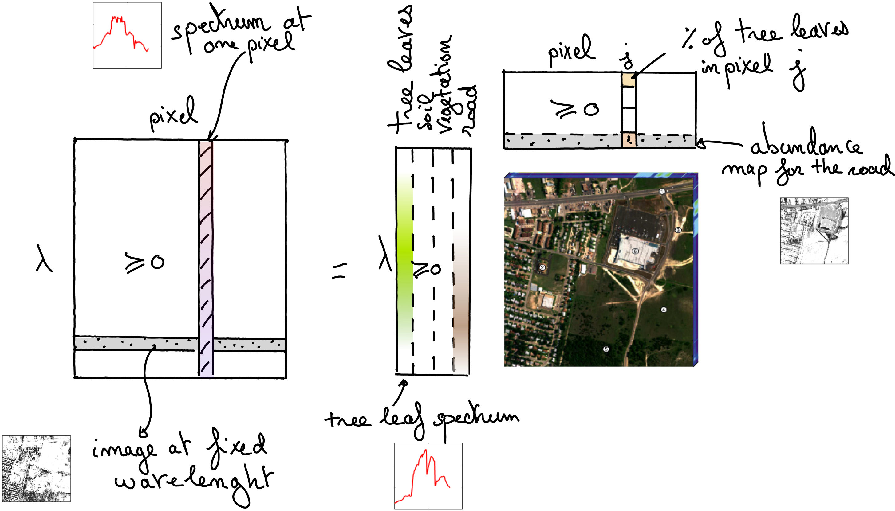{width="100%"}

:::
::::

## Source separation viewpoint

:::: {.columns}
::: {.column width="58%"}

- columns of $W$: latent sources / templates
- columns of $H^\top$: activations / mixing coefficients
- low rank = small number of sources

With $r$ sources:

$$
M \approx WH^\top,\qquad W\in\mathbb{R}_+^{n_1\times r},\;H\in\mathbb{R}_+^{n_2\times r}.
$$

:::
::: {.column width="42%"}

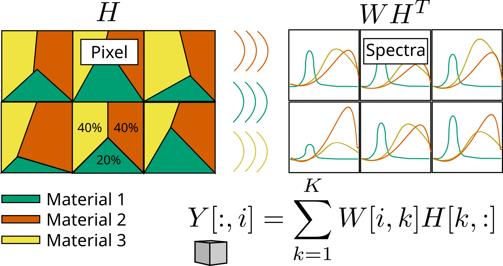{width="100%"}

:::
::::

# Matrix model details

## Matrix as a collection of vectors

:::: {.columns}
::: {.column width="52%"}

Let $M \in \mathbb{R}^{n_1 \times n_2}$.

- each column of $M$ is a vector in $\mathbb{R}^{n_1}$
- if all columns lie in a subspace of dimension $r$, then

$$
M = UV^\top
$$

with $U \in \mathbb{R}^{n_1 \times r}$ and $V \in \mathbb{R}^{n_2 \times r}$.

:::
::: {.column width="48%"}

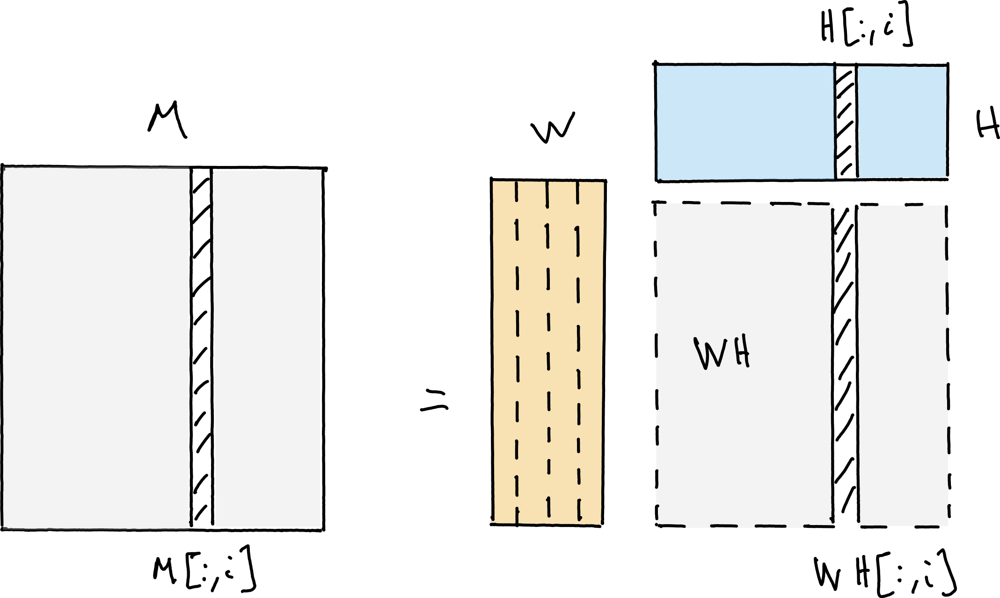{width="92%"}

:::
::::

## Low rank as dimensionality reduction

- $U$ stores a basis of a low-dimensional subspace
- each row of $V$ stores coordinates in that basis
- if $r \ll \min(n_1,n_2)$, the data admits a compact representation

This is the linear-algebra view of low rank.

## Low rank as a sum of rank-one atoms

The same model can be written as

$$
M[i,j] = \sum_{q=1}^{r} U[i,q]V[j,q]
$$

or equivalently

$$
M = \sum_{q=1}^{r} U[:,q]V[:,q]^\top.
$$

## Why rank-one atoms matter

- rank-one matrices are simple building blocks
- a low-rank matrix uses only a few such atoms
- low rank is therefore a notion of **model complexity**

This atomic viewpoint will transfer nicely to tensors.

## Parameter counting

- full matrix: $n_1 n_2$ parameters
- rank-$r$ factorization: $(n_1+n_2)r$ parameters

When $r$ is small, low-rank models can both

- compress data
- reveal latent structure

## Exact factorization vs approximation

In applications, the data is usually **not exactly** low rank.

We therefore seek a rank-$r$ approximation:

$$
\min_{\operatorname{rank}(N)\le r} \|M-N\|_F^2
$$

or, in factorized form,

$$
\min_{U,V} \|M-UV^\top\|_F^2.
$$

## The Eckart-Young theorem

If $M = ASB^\top$ is an SVD, then the best rank-$r$ approximation in Frobenius norm is given by the truncated SVD:

$$
M_r = A_{:,1:r} S_{1:r,1:r} B_{:,1:r}^\top.
$$

This is one of the rare nonconvex problems with a direct optimal solution.

## PCA as a low-rank approximation

{width="82%"}

## Why this result is exceptional

- It relies on
  - Frobenius (or spectral) norm
  - no extra constraints
  - orthogonality hidden in the SVD
- As soon as we change the loss or add constraints, closed forms usually disappear

## When SVD is not enough

In source separation, the factors must often satisfy physical properties:

- nonnegativity
- sparsity
- simplex constraints
- structural coupling across modes

Then "best approximation" is no longer the full story.

## Why are data matrices often approximately low-rank?

Three recurring explanations:

1. latent-variable models often generate approximately low-rank matrices
2. separable multivariate phenomena produce rank-one terms
3. mixtures of a few sources naturally lead to small-rank models

## Reason 1: latent variables

- many generative models depend on a small number of hidden variables
- observed features become correlated
- the data matrix is then well approximated in a low-dimensional subspace

## Reason 2: separable maps

Rank-one matrices correspond to separable functions:

$$
f(x,y)=f_1(x)f_2(y).
$$

Sums of a few separable terms are ubiquitous in physics and signal processing.

## Reason 3: source separation

- a few sources are mixed in varying proportions
- templates stay mostly fixed
- activations vary across samples

Hence

$$
M \approx UV^\top
$$

with a rank equal to the number of sources.

## But do the factors mean anything?

Approximation quality alone is not enough.

We also care about:

1. **identifiability**: are the factors essentially unique?
2. **robustness**: are they stable in the presence of noise?

## Rotation ambiguity

If

$$
M = U_1V_1^\top = U_2V_2^\top,
$$

then in general

$$
U_1 = U_2Q,\qquad V_1 = V_2Q^{-\top}
$$

for some invertible matrix $Q$.

## Consequence of rotation ambiguity

- the subspace may be identifiable
- the individual factors are generally **not**
- this is a major obstacle for source separation

So we need **regularization** or a richer model.

# Nonnegative Matrix Factorization

## Definition of NMF

For a nonnegative matrix $M$,

$$
M \approx WH
$$

with

$$
W \in \mathbb{R}_+^{n_1 \times r}, \qquad H \in \mathbb{R}_+^{r \times n_2}.
$$

## Why nonnegativity?

Nonnegativity is natural when factors represent:

- spectra
- concentrations
- images
- abundances
- energies
- probabilities or counts

## NMF as a constrained approximation problem

Typical formulation in Frobenius norm:

$$
\min_{W \ge 0,\; H \ge 0} \|M-WH\|_F^2
$$

- no general closed form
- nonconvex
- still tractable in practice

## What changes compared to SVD?

- better interpretability
- physically plausible factors
- potentially improved identifiability

but also

- harder optimization
- no exact analogue of truncated SVD
- rank selection becomes more difficult

## How do we fit NMF?

High-level idea:

1. fix $H$, update $W$
2. fix $W$, update $H$
3. repeat until convergence

This is the core principle behind many alternating algorithms.

## Alternating optimization at a glance

:::: {.columns}
::: {.column width="52%"}

At a high level, we cycle between simple subproblems:

$$
\begin{cases}
W^{(k+1)} = \arg\min_{W \ge 0} f(M,WH) + g_W(W) \\
H^{(k+1)} = \arg\min_{H \ge 0} f(M,W^{(k+1)}H) + g_H(H)
\end{cases}
$$

- one block is updated at a time
- each step is simpler than the full problem
- this philosophy extends to nCP and NTD

:::
::: {.column width="48%"}

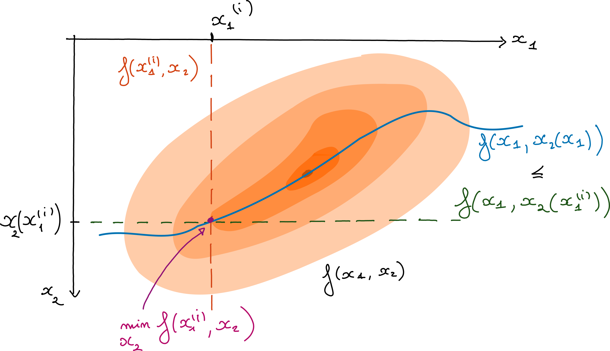{width="100%"}

:::
::::

## Fitting NMF in practice

Common choices include:

- Alternating Nonnegative Least Squares (ANLS)
- Hierarchical Alternating Least Squares (HALS)
- multiplicative updates

Lecture 2 will explain why NNLS is the central subproblem.

## The rank question

- in SVD, singular values help a lot
- in NMF, deflation is not so simple
- several ranks are often tried in practice
- the smallest exact feasible rank is the **nonnegative rank**

## NMF geometry: conic viewpoint

Each column of $M$ belongs to the cone generated by the columns of $W$:

$$
M[:,j] \in \operatorname{cone}(W).
$$

NMF is therefore a geometric problem in the nonnegative orthant.

## A conic interpretation of NMF

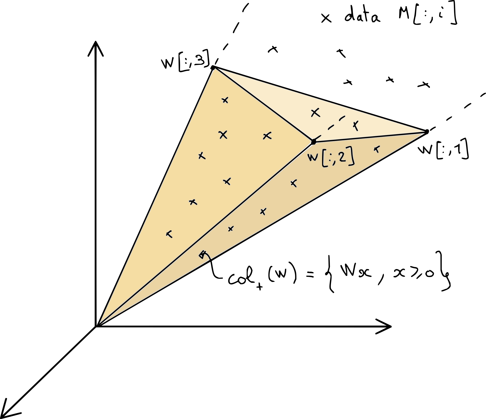{width="78%"}

## Why NMF is often non-unique

Even with nonnegativity, many cones may contain the same data cloud.

- low reconstruction error does not imply factor uniqueness
- good source separation needs stronger geometric information

## A simple picture of non-uniqueness

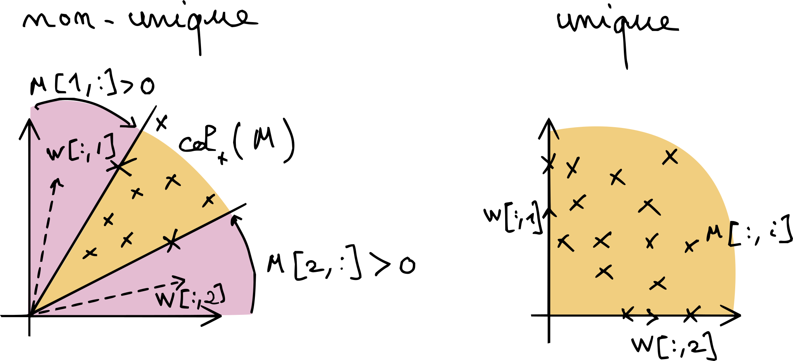{width="80%"}

## Normalizing onto the simplex

If columns are $\ell_1$-normalized, we can project the geometry onto the simplex.

Then:

- data become points in a polytope
- columns of $W$ become vertices or extreme rays
- columns of $H^\top$ describe convex combinations

## Exact NMF on the simplex

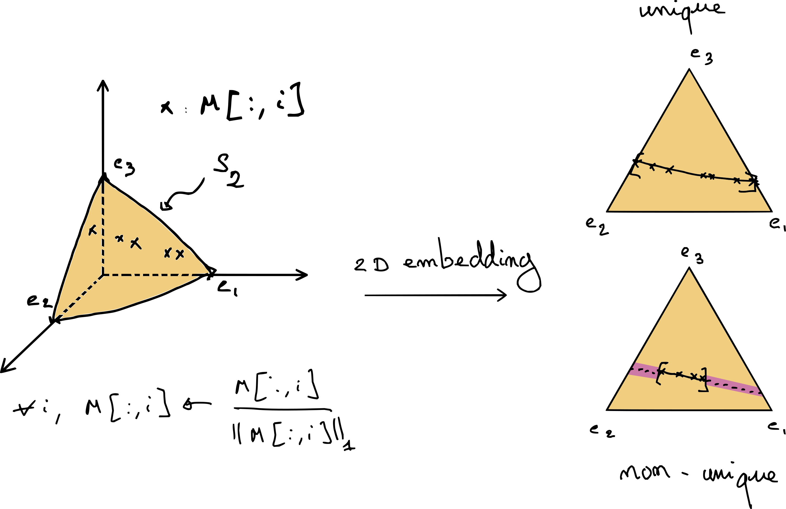{width="88%"}

## Geometric lesson from the simplex view

For low-dimensional exact NMF:

- uniqueness becomes possible when data touch the boundary
- if data remain strictly inside, many factorizations may coexist

So the data geometry matters as much as the loss function.

## A key identifiability idea: sufficiently scattered

- data should spread widely inside the cone / simplex
- points should get close to extreme directions
- the feasible cone around the data becomes much tighter

This explains why sparse or extreme observations are very valuable.

## Three major regularization families for NMF

1. **Separable NMF**
2. **Sparse NMF**
3. **Minimum-volume / maximum-volume NMF**

All aim at ruling out unrealistic factorizations.

## Separable NMF

Assumption:

$$
M = M[:,\mathcal{K}] H
$$

for some subset of columns $\mathcal{K}$.

Interpretation: the templates are present in the data themselves.

## Geometry of separable NMF

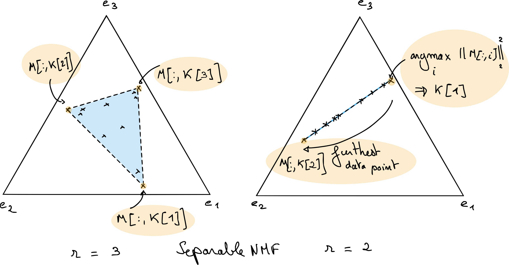{width="88%"}

## Why separable NMF is useful

- strong interpretability
- efficient algorithms exist
- excellent initialization for generic NMF solvers

Limitation:

- it fails when no nearly pure data point is observed

## Sparse NMF

Typical idea:

$$
\min_{W,H \ge 0} \|M-WH\|_F^2 + \lambda\,\Omega(W,H)
$$

with $\Omega$ promoting zeros in $W$ and/or $H$.

Sparsity often pushes solutions toward more identifiable geometries.

## Minimum-volume NMF

- choose the cone generated by $W$ as tight as possible around the data
- relaxes the pure-pixel assumption of separability
- often linked to maximizing the spread of coefficients in $H$

Very relevant when mixtures are real but pure sources are absent.

## NMF: what to remember

- NMF is much more interpretable than unconstrained LRA
- but nonnegativity alone does **not** solve everything
- identifiability depends on geometry and regularization
- optimization deserves dedicated methods

## Short pause before tensors

Matrices model mixtures indexed by two axes.

But many datasets are naturally indexed by:

- frequency × time × bar
- wavelength × row × column
- feature × sample × condition

This leads to tensors.

# Tensor decompositions

## Why tensors?

- multiway data carries richer structure than a flattened matrix
- flattening may destroy interactions between modes
- multilinear models preserve these interactions

## What is a tensor?

Informally:

- a scalar is order 0
- a vector is order 1
- a matrix is order 2
- a tensor is order 3 or more

In data science, tensors are often just multiway arrays.

## Matrix intuition still helps

Good news:

- many tensor ideas are extensions of matrix ideas
- rank-one building blocks still matter
- alternating algorithms still appear

Bad news:

- uniqueness and optimization behave differently

## Rank-one tensors

For a third-order tensor,

$$
x \otimes y \otimes z
$$

is the tensor with entries

$$
(x \otimes y \otimes z)[i,j,k] = x[i]y[j]z[k].
$$

## Two main tensor models today

1. **CP decomposition**
   - sum of rank-one tensors
2. **Tucker decomposition**
   - multilinear dimensionality reduction with a core tensor

## CP decomposition

For $T \in \mathbb{R}^{n_1 \times n_2 \times n_3}$,

$$
T[i,j,k] = \sum_{q=1}^{r} A[i,q]B[j,q]C[k,q].
$$

It is the tensor analogue of decomposing data into rank-one atoms.

## CP decomposition as a picture

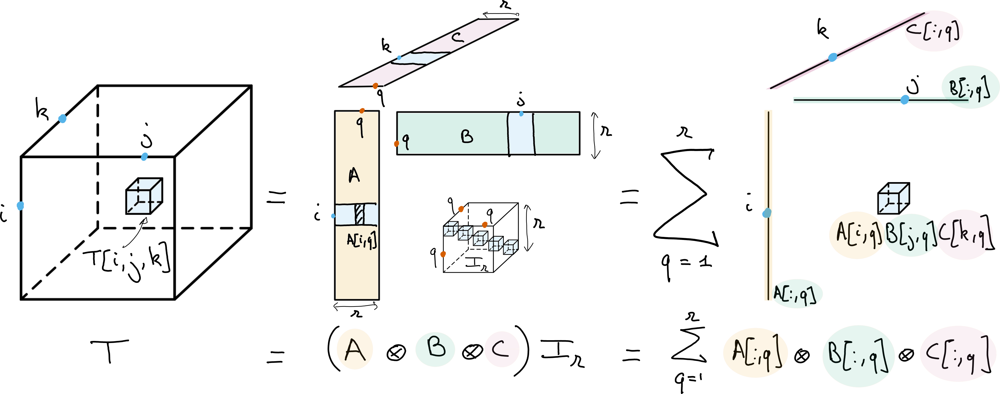{width="82%"}

## Why CP is important

- it can be essentially unique under generic conditions
- this is a major contrast with matrix factorizations
- it is both a source separation model and a dimensionality reduction tool

## Where does CP identifiability come from?

Very informally:

- each slice must share the same latent factors
- this coupling removes rotation ambiguities
- the intersection of all compatible matrix factorizations becomes much smaller

## CP as coupled matrix factorization

For each slice $k$,

$$
T[:,:,k] = A\,\operatorname{Diag}(C[k,:])\,B^\top.
$$

Same factors $A$ and $B$ are reused across all slices.

That shared structure is the key.

## Approximate CP decomposition

With Frobenius loss, we solve

$$
\min_{A,B,C} \|T-\llbracket A,B,C \rrbracket\|_F^2.
$$

This is again a nonconvex multiblock problem.

## How is CP fitted?

The classical algorithm is **ALS**:

1. update $A$
2. update $B$
3. update $C$
4. repeat

Each subproblem is linear least squares.

## A caveat: CP approximation can be ill-posed

- the set of tensors of rank at most $r$ is not closed
- a best rank-$r$ approximation may fail to exist
- components can diverge while compensating each other

This is very different from the matrix case.

## Why regularization matters again

Regularization for tensor models can help with:

- interpretability
- robustness
- optimization landscape
- **existence of a minimizer**

## Nonnegative CP decomposition

For nonnegative tensor data,

$$
\min_{A \ge 0,\; B \ge 0,\; C \ge 0}
\|T-\llbracket A,B,C \rrbracket\|_F^2
$$

This is the direct tensor analogue of NMF.

## Why nonnegative CP is attractive

- factors remain physically meaningful
- nonnegativity prevents cancellation at infinity
- the approximation problem becomes well posed

So nonnegativity helps both modeling **and** optimization.

## How do we fit nonnegative CP?

- alternating updates are still the default choice
- each factor update becomes a set of **NNLS** problems
- the method is often called **ANLS**

Again, Lecture 2 will provide the algorithmic engine.

# Tucker and nonnegative Tucker

## Tucker decomposition

For a third-order tensor,

$$
T = \llbracket U,V,W;G \rrbracket
$$

with:

- factor matrices $U,V,W$
- a smaller core tensor $G$

## Tucker decomposition as a picture

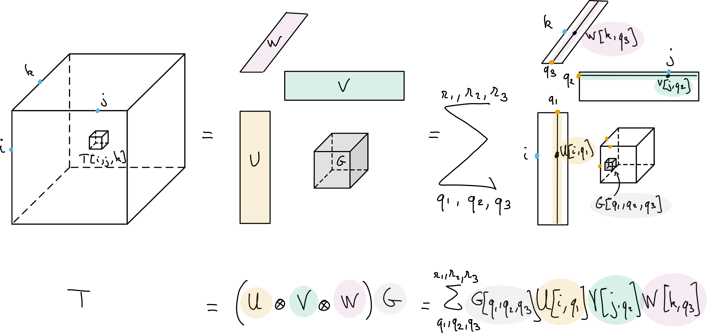{width="82%"}

## Tucker as multilinear dimensionality reduction

The model writes

$$
T = G \times_1 U \times_2 V \times_3 W.
$$

- $U,V,W$ define low-dimensional subspaces
- $G$ stores interactions in reduced coordinates

## Multilinear ranks

Instead of one rank $r$, Tucker uses

$$
(r_1,r_2,r_3)
$$

with $r_i \le n_i$.

This gives much more flexibility than CP.

## Tucker vs CP

**CP**

- diagonal core
- stronger compression
- stronger uniqueness properties

**Tucker**

- dense core
- more flexible interactions
- closer to matrix subspace models

## Tucker is not identifiable in general

There are rotation ambiguities in each mode:

$$
U \mapsto UQ,\qquad G \mapsto G \times_1 Q^{-1}
$$

and similarly for the other modes.

So Tucker is usually **not** unique without extra constraints.

## Classical Tucker regularization

The standard choice is **orthogonality**:

- orthogonal factors define principal multilinear subspaces
- HOSVD gives a strong computational baseline

This is the tensor counterpart of PCA-style dimensionality reduction.

## Nonnegative Tucker decomposition (NTD)

For nonnegative data, we may instead seek

$$
T \approx \llbracket U,V,W;G \rrbracket
$$

with

$$
U,V,W,G \ge 0.
$$

## Why nonnegative Tucker?

- preserves interpretability in every mode
- more flexible than nCP when interactions are not diagonal
- often very natural for count, spectrogram, or image-like tensors

## Application viewpoint for NTD

:::: {.columns}
::: {.column width="55%"}

For music structure analysis, a tensor can index:

- frequency
- time within a bar
- bar index

NTD then extracts recurring patterns jointly across these modes.

:::
::: {.column width="45%"}

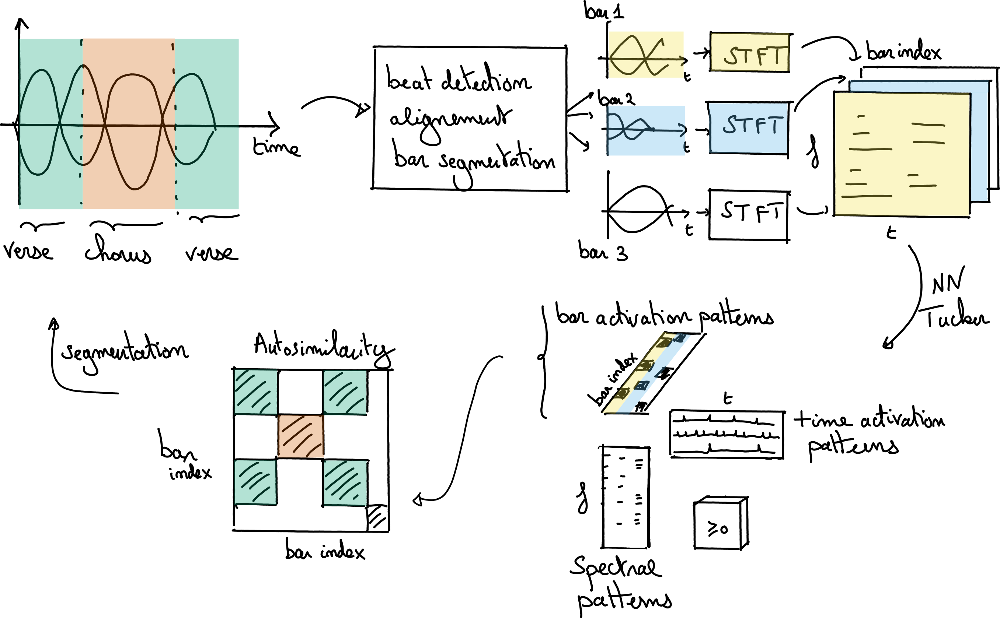{width="100%"}

:::
::::

## How do we fit NTD?

Typical strategy:

1. fix all blocks except one
2. solve a nonnegative least-squares type subproblem
3. cycle over factor matrices and the core tensor

This is again alternating optimization.

## NTD is algorithmically close to NMF

- same nonnegativity philosophy
- same NNLS building blocks
- same importance of initialization and scaling
- but more expensive tensor contractions

## The main open question

For NTD, a major unresolved theme is:

### when is the decomposition identifiable?

Compared with CP, the answer is still much less complete.

## Why this matters

If NTD is used only for compression, ambiguity may be acceptable.

If NTD is used for:

- source separation
- pattern discovery
- scientific interpretation

then ambiguity becomes a real issue.

## A practical summary of tensor choices

- choose **CP/nCP** when rank-one latent components are expected
- choose **Tucker/NTD** when multilinear subspaces and interactions matter
- add regularization when interpretability is essential

# Wrap-up

## What we learned today

- low-rank models can be read as compression tools **and** source separation models
- unconstrained matrix LRA is powerful but not identifiable enough
- NMF introduces physically meaningful constraints
- tensors extend the story with CP and Tucker models

## The recurring theme

Across all these models, three questions keep coming back:

1. **What structure do we want?**
2. **Is it identifiable?**
3. **How do we optimize it efficiently?**

## Looking ahead to Lecture 2

Lecture 2 focuses on the optimization core behind these models:

- Nonnegative Least Squares (NNLS)
- KKT conditions
- HALS
- multiplicative updates
- KL-based variants

## Take-home message

Low-rank approximation is easy to motivate.

Interpretable low-rank approximation is the real challenge.

That is precisely why **nonnegativity, geometry, and optimization** matter so much.
